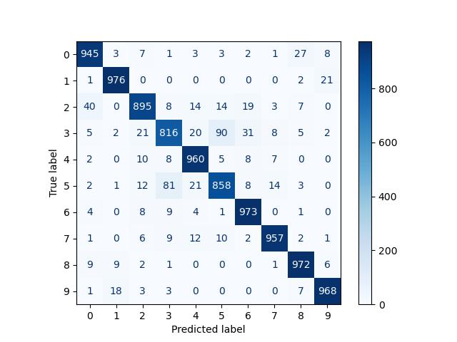
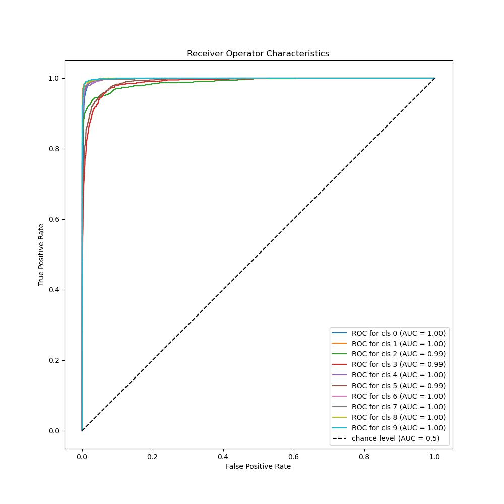

# FreeMatch - Self-adaptive Thresholding for Semi-supervised Learning

This repository contains the unofficial implementation of the paper **FreeMatch: Self-adaptive Thresholding for Semi-supervised Learning.** This was the part of the Paper Reproducibility Challenge project in my course of *EECS6322: Neural Networks and Deep Learning* course. The original paper can be found from this [link](https://arxiv.org/pdf/2205.07246.pdf).

The official paper published their results on five datasets viz. CIFAR10, CIFAR100, SVHN, STL10, and ImageNet datasets. But, due to GPU constraints, I was able to run the scripts for only CIFAR10 dataset with different number of labeled data examples on one Tesla T4 on Google Cloud. The installation of libraries and running the scripts is explained in the later sections. The logs and the checkpoint of the experiments on CIFAR10 dataset can be obtained [here](https://drive.google.com/drive/folders/1_Hip4LOGPju_KOqL4FBJk2WCVkzf7TWu?usp=share_link)

## Disclaimer

All the theorems, propositions, and the proof are taken from the paper by Wang et.al. I have just reproduced the paper to show the main experiments and the results following the propositions of their work in Semi-Supervised Learning. I would like to thank the authors for their outstanding work on a new approach to semi-supervised learning and detailed analysis of the working of the same. To get into the details of all the loss functions and their proofs, read the original paper.

## Running the Experiments

### Setup

1. `git clone https://github.com/shreejalt/freematch-pytorch`
2. `cd freematch-pytorch && install_anaconda.sh`
3. `conda env create -f environment.yml`

### Running the scripts

All the config files for CIFAR10 and CIFAR100 are present in the `config` folder. It follows the `yacs` and logging format inspired from [Dassl.pytorch](https://github.com/KaiyangZhou/Dassl.pytorch). You can visit the given link to learn more about `yacs.config.CfgNode` structure. 

The script `main.py` contains argument parser which can be used to overwrite the config file of the experiment. 

```python
	main.py [-h] [--config-file CONFIG_FILE] [--run-name RUN_NAME]
               [--output-dir OUTPUT_DIR] [--log-dir LOG_DIR] [--tb-dir TB_DIR]
               [--resume-checkpoint RESUME_CHECKPOINT] [--cont-train]
               [--validate-only] [--train-batch-size TRAIN_BATCH_SIZE]
               [--test-batch-size TEST_BATCH_SIZE] [--seed SEED]

optional arguments:
  -h, --help            show this help message and exit
  --config-file CONFIG_FILE
                        Path to the config file of the experiment
  --run-name RUN_NAME   Run name of the experiment
  --output-dir OUTPUT_DIR
                        Directory to save model checkpoints
  --log-dir LOG_DIR     Directory to save the logs
  --tb-dir TB_DIR       Directory to save tensorboard logs
  --resume-checkpoint RESUME_CHECKPOINT
                        Resume path of the checkpoint
  --cont-train          Flag to continue training
  --validate-only       Flag for validation only
  --train-batch-size TRAIN_BATCH_SIZE
                        Training batch size
  --test-batch-size TEST_BATCH_SIZE
                        Testing batch size
  --seed SEED           Seed
```

To execute the training, execute the command 

`python3 main.py --config-file config/cifar10/freematch_cifar10_10.yaml`

This will start the training by running the `train()` function in `trainer.py`. 


You can also use your model checkpoints to validate the results. Run the command <br\>

`python3 main.py --validate-only --config-file config/cifar10/freematch_cifar10_10.yaml --resume logs/freematch_cifar10_10/model_ckpt/best_checkpoint.pth`. 


Note that, you need to add `--validate-only` flag everytime you want to test your model. This file will run the `test()` function from `tester.py` file. 


## Results

I ran all the experiments on CIFAR10 dataset using Mixed Precision Training in PyTorch. The below given table shows the reproduced results and the original published results. Also, all the training are logged using TensorBoard which can be used to visualize the loss curves. 

The official repository can be found from this [link](https://github.com/microsoft/Semi-supervised-learning). Some of the ideas are taken from the official repository's FreeMatch implementation.


| Method             | Num Labeled: 10 | Num Labeled: 40 | Num Labeled: 250 | Num Labeled: 4000 |
| ------------------ | --------------- | --------------- | ---------------- | ----------------- |
| FreeMatch          | 92.93±4.28      | 95.10±0.04      | 95.12±0.18       | 95.9±0.02         |
| Reproduced Results | 93.00           | 94.13           | 95.02            | 95.1              |

Once the testing is over, all the results will be stored in `LOG_DIR/RUN_NAME` folder present in the `config` file. Below given are some of the results on the CIFAR10 (10) dataset with the checkpoint report given in blocks.

<p float="center">
  
   

</p>


```
Run Name: freematch_cifar10_10 | Dataset: cifar10 | Network Name: wrn_28_2 | Num labeled: 10 

{'loss': 0.30913862426280975, 'accuracy': 0.932, 'precision': 0.9314379217610952, 'recall': 0.932, 'f1': 0.9314966279848587, 'auc': 0.9957382944444444}
** Classification Report **

              precision    recall  f1-score   support

           0       0.94      0.94      0.94      1000
           1       0.97      0.98      0.97      1000
           2       0.93      0.90      0.91      1000
           3       0.87      0.82      0.84      1000
           4       0.93      0.96      0.94      1000
           5       0.87      0.86      0.87      1000
           6       0.93      0.97      0.95      1000
           7       0.97      0.96      0.96      1000
           8       0.95      0.97      0.96      1000
           9       0.96      0.97      0.97      1000

    accuracy                           0.93     10000
   macro avg       0.93      0.93      0.93     10000
weighted avg       0.93      0.93      0.93     10000

** Confusion Matrix **

[[945   3   7   1   3   3   2   1  27   8]
 [  1 976   0   0   0   0   0   0   2  21]
 [ 40   0 895   8  14  14  19   3   7   0]
 [  5   2  21 816  20  90  31   8   5   2]
 [  2   0  10   8 960   5   8   7   0   0]
 [  2   1  12  81  21 858   8  14   3   0]
 [  4   0   8   9   4   1 973   0   1   0]
 [  1   0   6   9  12  10   2 957   2   1]
 [  9   9   2   1   0   0   0   1 972   6]
 [  1  18   3   3   0   0   0   0   7 968]]


```

## Citations

```
@article{wang2023freematch,
  title={FreeMatch: Self-adaptive Thresholding for Semi-supervised Learning},
  author={Wang, Yidong and Chen, Hao and Heng, Qiang and Hou, Wenxin and Fan, Yue and and Wu, Zhen and Wang, Jindong and Savvides, Marios and Shinozaki, Takahiro and Raj, Bhiksha and Schiele, Bernt and Xie, Xing},
  booktitle={International Conference on Learning Representations (ICLR)},
  year={2023}
}
@inproceedings{usb2022,
  doi = {10.48550/ARXIV.2208.07204},
  url = {https://arxiv.org/abs/2208.07204},
  author = {Wang, Yidong and Chen, Hao and Fan, Yue and Sun, Wang and Tao, Ran and Hou, Wenxin and Wang, Renjie and Yang, Linyi and Zhou, Zhi and Guo, Lan-Zhe and Qi, Heli and Wu, Zhen and Li, Yu-Feng and Nakamura, Satoshi and Ye, Wei and Savvides, Marios and Raj, Bhiksha and Shinozaki, Takahiro and Schiele, Bernt and Wang, Jindong and Xie, Xing and Zhang, Yue},
  title = {USB: A Unified Semi-supervised Learning Benchmark for Classification},
  booktitle = {Thirty-sixth Conference on Neural Information Processing Systems Datasets and Benchmarks Track}
  year = {2022}
}

@article{zhou2022domain,
  title={Domain generalization: A survey},
  author={Zhou, Kaiyang and Liu, Ziwei and Qiao, Yu and Xiang, Tao and Loy, Chen Change},
  journal={IEEE Transactions on Pattern Analysis and Machine Intelligence},
  year={2022},
  publisher={IEEE}
}

@article{zhou2021domain,
  title={Domain adaptive ensemble learning},
  author={Zhou, Kaiyang and Yang, Yongxin and Qiao, Yu and Xiang, Tao},
  journal={IEEE Transactions on Image Processing},
  volume={30},
  pages={8008--8018},
  year={2021},
  publisher={IEEE}
}
```

